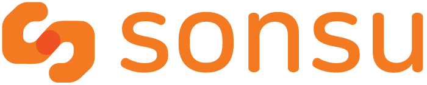
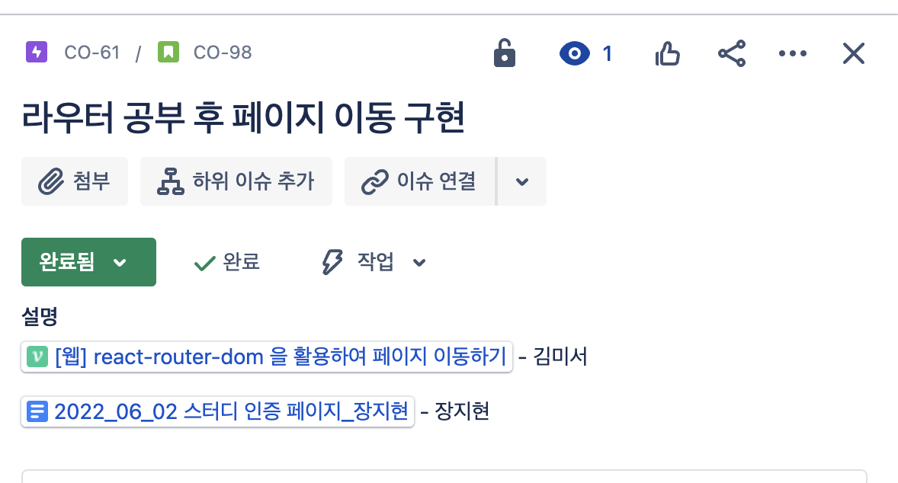

<!--  -->

 

 
<h3>' 수어를 배우고 싶은 모든 사람을 위한 수어 교육 플랫폼 '</h3>

국립국어원의 한국 수어 사전의 영상자료를 바탕으로 수어를 익히고, 학습자의 손동작을 인식하여 동작의 정확도를 알 수 있는 교육환경을 제공하는 서비스 입니다.

 

## 🤲 About

> 농아인들은 의사소통을 위해 수어를 주된 언어로 사용하지만 이들에 대한 전문적인 수어 교육은 제대로 이루어지지 않고 있습니다.
>
> 따라서 저희는 수어 교육의 한계를 극복하고 농아인 뿐만 아니라 많은 사람들이 수어로 소통할 수 있는 세상을 만들고자 ‘SONSU’ 를 기획하게 되었습니다.
>
> SONSU를 통해 수어를 익히고, 직접 따라해 보면서 보다 정확한 동작을 익혀보세요.
>
> 손으로 세상과 소통하는 수어교실, 여기는 **SONSU** 입니다.👋
>  

## 👐 Main Feat

- **`따라하기`**
  사용자의 수어 동작 영상을 인식하여 얼마나 정확한 동작을 수행했는지 알 수 있습니다.
- **`수강하기`**
  초급, 중급, 고급으로 단계를 나누어 체계적으로 학습을 진행할 수 있습니다.
- **`테스트하기`**
  사용자가 단계를 선택하여 테스트를 볼 수 있습니다.
- **`오답노트`**
  테스트에서 틀린 단어들을 모아 놓은 오답노트를 확인하고, 해당 단어 영상을 다시 볼 수 있습니다.

 

## 🙌 Detail

<!-- <table align="center">
<thead>
<tr margin-bottom=3px>
<td width="500" align="center">
<b>홈화면<b>
</td>
<td width="500" align="center">
<b>
단계 선택 후 강의 목록
</b>

</td>
</tr>
</thead>
<tbody>
<tr>
<td width="500" align="center">

</td>

<td width="500" align="center">

</td>
</tr>
<tr>
<td width="500" align="center">

<b>
강의 수강
</b>
</td>
<td width="500" align="center">

<b>
따라하기
</b>
</td>
</tr>
<tr>
<td width="300" align="center">

</td>
<td width="300" align="center">

</td>
</tr>
<tr>
<td width="300" align="center">

<b>
따라하기 결과 확인
</b>
</td>
<td width="300" align="center">

<b>
테스트 단계 선택
</b>
</td>
</tr>
<tr>
<td width="300" align="center">

</td>
<td width="300" align="center">

</td>
</tr>
<tr>
<td width="300" align="center">

<b>
테스트 진행
</b>
</td>
<td width="300" align="center">

<b>
테스트 결과 보기
</b>
</td>
</tr>
<tr>
<td width="300" align="center">

</td>
<td width="300" align="center">

</td>
</tr>
<tr>
<td width="300" align="center">

<b>
마이 페이지 (개인 정보 및 진행 상황 시각화)
</b>
</td>
<td width="300" align="center">

<b>
성젹표 확인 (월별 / 단계별)
</b>
</td>
</tr>
<tr>
<td width="300" align="center">

</td>
<td width="300" align="center">

</td>
</tr>
<td width="300" align="center">

<b>
오답 노트 확인 (월별)
</b>
</td>
</tr>
<td width="500" align="center">
<tr>
<td width="300" align="center">

</td>
</tr>
<tr>
<td width="300" align="center">

</tbody>
</table> -->

## ✨ Video

 

## 👍 How To Use

<!--  -->
<!-- -->

## 🫱 ERD

 

## ✊ Architecture

 

## Skills

   
 

 

## Tools

  

 

## 🧑‍🤝‍🧑 팀원 소개
|     |      |     |      |   |
| :---: | :---:| :---: | :---: | :---: |
|Front-End & Deep Learning|Back-End & Design|Full-Stack & Deep Learning|Front-End & Data| Design |
| [김미서](https://github.com/seomiii) | [유문희](https://github.com/muunioi) | [장지현](https://github.com/jihyeonjjang) | [최정윤](https://github.com/jeong-yooon) | [김지은](kze5453@naver.com) |

 

## 🫰 협업 문화

 매주 3회 이상 회의 및 회의록 기록

✅ 매주 3회 이상 회의를 진행하고, 회의록을 기록합니다.

 매주 3회 (수,목,토) 개인 스터디 및 기록

✅ 프로젝트 관련 스터디를 진행하고, 인증합니다.

✅ 프로젝트를 진행하고, 진행상황을 기록합니다.

 매주 이슈 등록 및 진행상황 공유 

✅ 매주 월요일 회의에서 설정한 목표를 에픽으로 등록하고, 담당자를 할당하여 역할을 분담합니다.

✅ 해당 에픽을 완료하면 상태를 변경하고, 진행상황을 공유할 수 있는 문서를 등록합니다. 

 의사소통 및 진행상황 공유 

✅ 다양한 채널을 개설하여 목적에 맞게 소통합니다.

✅ 개발 과정 중 발생하는 이슈 & 궁금한 점을 공유합니다.

✅ 개인 스터디 이후 다른 팀원들이 간략하게 볼 수 있도록 요약하여 공유합니다. 

✅ 비동기적 소통을 지향합니다. 

 

## 👍 성과

- 2022 이브와 ICT 멘토링 공모전 본상 수상(동상, IT여성기업인협회장상)
- 2022년 덕성여자대학교 캡스톤 디자인 경연대회 우수상 수상
- [디지털콘텐츠학회 논문 게재(제 23권 제 11호, ‘딥러닝 기반 수어 교육 온라인 플랫폼 구현’, p.2147~p.2157)](http://journal.dcs.or.kr/_PR/view/?aidx=34798&bidx=3125)

 

<!-- ## References
[딥러닝 기반 OpenPose를 이용한 한국 수화 동작 인식에 관한 연구](http://journal.dcs.or.kr/_PR/view/?aidx=29041&bidx=2548) -->
<!-- https://www.youtube.com/watch?v=Npx0fNAF2hg -->
<!-- ## Data References
#### aihub : https://aihub.or.kr/aidata/7965
#### original : https://sldict.korean.go.kr/front/main/main.do
#### other : http://vod.jbedu.kr/EgovPageLinkSub.do?menuNo=4000000&menuNoSub=4042500&link=forward%3A%2FvodMedia%2FloveHandDesc.do -->
